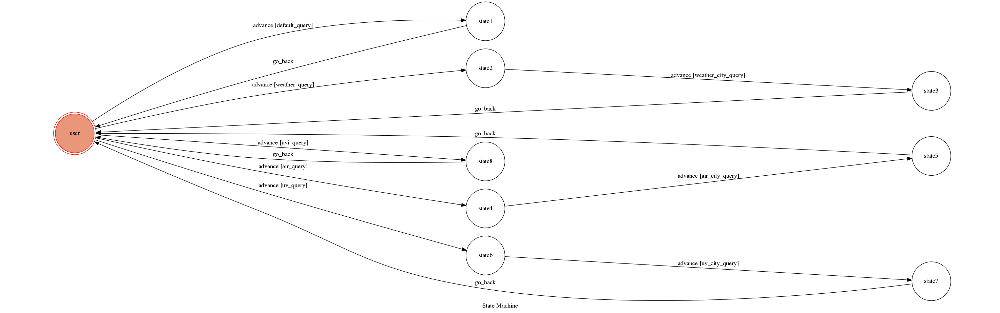

# TOC Project 2017

Template Code for TOC Project 2017

A telegram bot based on a finite state machine

## Setup

### Prerequisite
* Python 3

#### Install Dependency
```sh
pip install -r requirements.txt
```

* pygraphviz (For visualizing Finite State Machine)
    * [Setup pygraphviz on Ubuntu](http://www.jianshu.com/p/a3da7ecc5303)

### Secret Data

`API_TOKEN` and `WEBHOOK_URL` in app.py and `WEATHER_API_KEY` in fsm.py **MUST** be set to proper values.
Otherwise, you might not be able to run your code.

### Run Locally
You can either setup https server or using `ngrok` as a proxy.

**`ngrok` would be used in the following instruction**

```sh
ngrok http 5000
```

After that, `ngrok` would generate a https URL.

You should set `WEBHOOK_URL` (in app.py) to `your-https-URL/hook`.

#### Run the sever

```sh
python3 app.py
```

## Feature
1. A bot that can search some information for you, like the current weather, the current air quality, and the current UVI value.

2. You don't have to give it a exactly pre-defined sentence or word for quering something, it would recognizes your input and do the corresponding work for you. 

## Finite State Machine


## Usage
The initial state is set to `user`.

Every time `user` state is triggered to `advance` to another state.

* user
	* The start state.
	* Input: arbitrary sentences. For example: "HELLO!"
		* Reply:
        ``` 
				你好～ 可以問我目前的 天氣狀況、空氣狀況、或紫外線情形喔！
				你想知道些什麼呢～？
				
				(e.g. 今天天氣如何？)
        ```

* state2, state3
    * States for handling queries that ask currently weather.
    * 1st input: A sentence, like "今天天氣如何？" or "請問現在天氣情況怎樣？", then go to state2.
	    * Reply:
        ```
	            你想知道目前哪個縣市的天氣狀況呢？
	            (e.g. 臺南市)"
        ```

	* 2nd input: A name of a city in Taiwan, like "台南" or "臺南" or "台南市", then go to state3.
	    * Reply:
        ```
                臺南市目前的天氣為陰陣雨或雷雨。
                溫度為 25 至 28 ℃，降雨機率為 90 %。
        ```
    * Back to user state automatically.
    
* state4, state5
    * States for handling queries that ask current air quality.
    * 1st input: A sentence, like "現在空氣狀況如何？" or "告訴我目前的空氣狀況", then go to state4.
        * Reply:
        ```
                你想知道目前哪個縣市的空氣狀況呢？
                (e.g. 臺南市)
        ```
    * 2nd input: A name of a city in Taiwan, like "嘉義" or "台東", then go to state5.
        * Reply:
        ```
                嘉義市目前空氣品質良好！
                一氧化碳濃度(CO)：0.15
                臭氧濃度(O3)：12
                二氧化氮濃度(NO2)：None
                懸浮微粒濃度(PM10)：20
                細懸浮微粒濃度(PM2.5)：3
        ```
    * Back to user state automatically.
    
* state6, state7
    * States for handling queries that ask current UVI value.
    * 1st input: A sentence, like "請問現在紫外線狀況怎樣？" or "目前紫外線", then go to state6.
        * Reply:
        ```
                你想知道目前哪個縣市的紫外線狀況呢？
                (e.g. 臺南市)
        ```
    * 2nd input: A name of a city in Taiwan, like "台南" or "臺南市", then go to state7.
        * Reply:
        ```
                臺南市目前紫外線氣象指標(UVI)為 0。
                目前 UVI 屬於弱等級，基本上不須要保護措施！
                可以安心外出，但請留意瞬間紫外線。

                p.s. 如果不清楚紫外線氣象指標(UVI)是什麼的話，也可以問我喔～！
        ```
    * Back to user state automatically.
    
* state8
    * A state for handling queries that ask for what UVI is.
    * Input: A sentence, like "請問UVI是什麼？" or "紫外線氣象指標是啥？", then go to state8.
    * Reply: Information about UVI.
    * Back to user state automatically.
